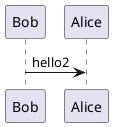
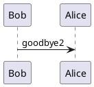

# Payment Solution

## Introduction
An outline and overview of the options and design patterns that could be used in a payment app built using JavaScript and React

## Architecture

### Data Flow

#### Handling Everything in the Browser

#### Handling Stripe via Backend Service

