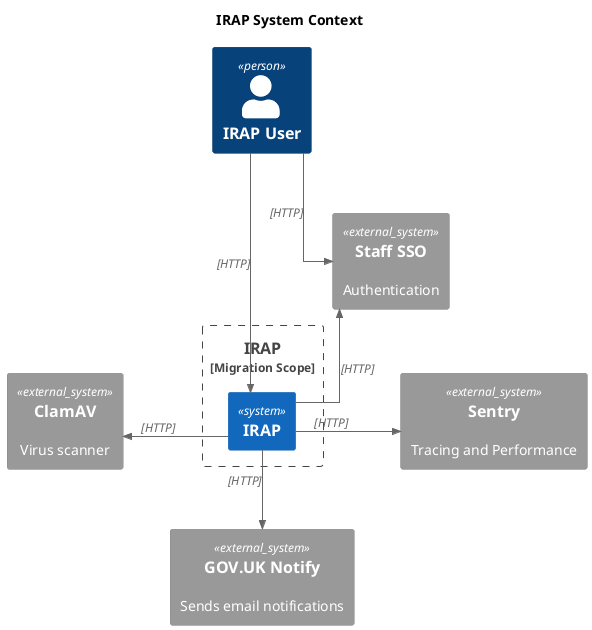
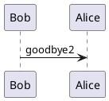

# Payment Solution

## Introduction

## UX

## Architecture

### Data Flow

#### Handling Everything in the Browser

#### Handling Stripe via Backend Service

## State Management

## Payment Provider Integration

## Theming

## Security

## Testing and Quality Assurance

## Conclusion and Questions