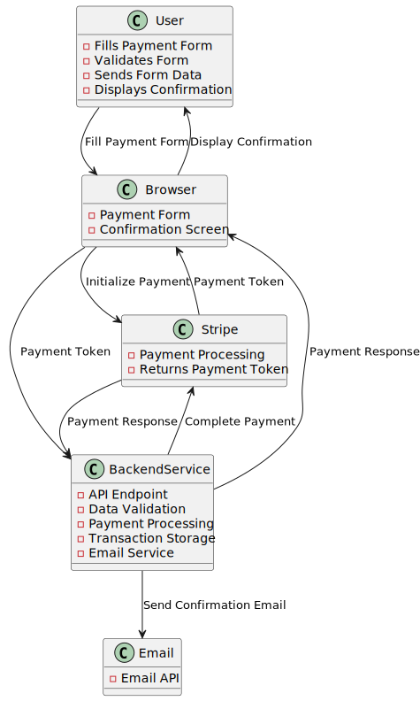

# Payment Solution

## Introduction
An outline and overview of the options and design patterns that could be used in a payment app built using JavaScript and React

## Architecture

### Data Flow

#### Handling Everything in the Browser


**Pros**
- Simple
- Quick *direct communication with payment server*
- Cheaper *no backend infrastructure required*
- Easier to deploy *there are less components*

**Cons**
- Security *handling things in the browser is less secure*
- Less app behavioral control *error handling is down to the payment provider*
- Compliance issues *due to the loss of security as above*
- Scalability *adding additional functionality might be more cumbersome*

#### Handling Stripe via Backend Service



**Pros**
- Better security *less data is exposed as this is kept server side*
- Better app behavioral control *errors can be more effectively controlled. Integration with other backend services (own email service?)*
- Compliance *easier to get compliance as is more secure*
- Scalability *would be easier to add functionality to the payment flow as the logic is primarily handled server side*

**Cons**
- More complex
- Slower *payment now has a second step of complexity to negotiate*
- More expensive *as there is more infrastructure*
- More to manage *there is more to deploy and maintain*

## Payment Service

Create a payment service class that can be extended for different payment services. This creates an interface that abstracts out the specific payment provider logic. This can be dynamically loaded to use the correct prover via env variable i.e. env.PAYMENT_PROVIDER

```
class PaymentService {
  initialisePayment(amount, currency) {
  }

  processPayment(token) {
  }

  handleWebhookFromPaymentProvider(event) {
  }
}
```

```
class StripePaymentService extends PaymentService {
   await initialisePayment(amount, currency) {
  }

  await processPayment(token) {
  }

  handleWebhookFromPaymentProvider(event) {
  }
}
```

```
class SomeOtherPaymentService extends PaymentService {
   await initialisePayment(amount, currency) {
  }

  await processPayment(token) {
  }

  handleWebhookFromPaymentProvider(event) {
  }
}
```
