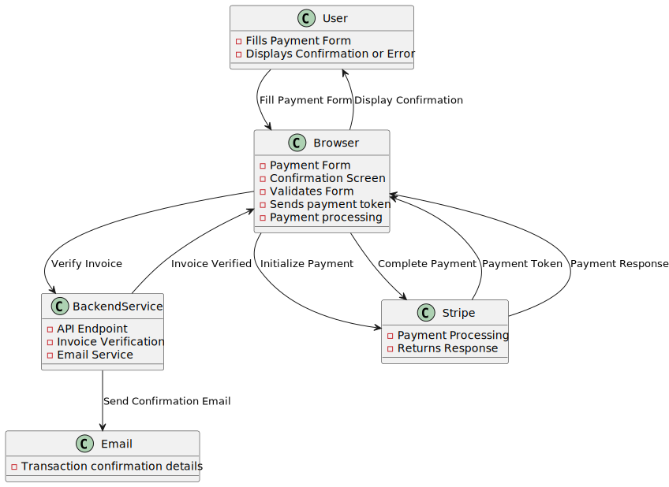
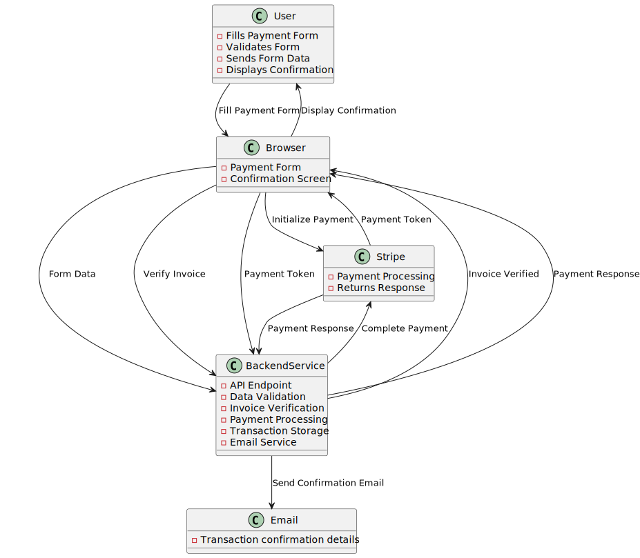

# Payment App Solution

## Introduction
An outline and overview of the options and design patterns that could be used in a payment app built using JavaScript and React for the Frontend


## Architecture

### Data Flow

#### Handling Everything in the Browser



**Pros**
- <span style="background-color: #c5ffc8; color: #000">Simple</span>
- <span style="background-color: #c5ffc8; color: #000">Quick - *direct communication with payment server*</span>
- <span style="background-color: #c5ffc8; color: #000">Cheaper - *no backend infrastructure required*</span>
- <span style="background-color: #c5ffc8; color: #000">Easier - to deploy *there are less components*</span>

**Cons**
- <span style="background-color: #ffcfc5;">Security - *handling things in the browser is less secure*</span>
- <span style="background-color: #ffcfc5;">Less app behavioral control - *error handling is down to the payment provider*</span>
- <span style="background-color: #ffcfc5;">Compliance issues - *due to the loss of security as above*</span>
- <span style="background-color: #ffcfc5;">Scalability - *adding additional functionality might be more cumbersome*</span>

#### Handling Stripe via Backend Service



**Pros**
- <span style="background-color: #c5ffc8; color: #000">Better security - *less data is exposed as this is kept server side*</span>
- <span style="background-color: #c5ffc8; color: #000">Better app behavioral control - *errors can be more effectively controlled. Integration with other backend services (own email service?)*</span>
- <span style="background-color: #c5ffc8; color: #000">Compliance - *easier to get compliance as is more secure*</span>
- <span style="background-color: #c5ffc8; color: #000">Scalability - *would be easier to add functionality to the payment flow as the logic is primarily handled server side*</span>

**Cons**
- <span style="background-color: #ffcfc5;">More complex</span>
- <span style="background-color: #ffcfc5;">Slower - *payment now has a second step of complexity to negotiate*</span>
- <span style="background-color: #ffcfc5;">More expensive - *as there is more infrastructure*</span>
- <span style="background-color: #ffcfc5;">More to manage - *there is more to deploy and maintain*</span>

> Preferred Choice: Integrating with a backend solution would enable the invoice lookup. Also transaction can be store in an ACID database such as PostgreSQL to ensure the integrity of the data.

## Payment Service

> Payment services provide their own client side library for capturing credit card details
> - frontend sends the payment details to the payment service
> - a payment token is received
> - this token is sent to the backend
> - backend processes the payment
> - payment provider will return webhook events
> - status sent back to the frontend

Create a payment service class that can be extended for different payment services. This creates an interface that abstracts out the specific payment provider logic. This can be dynamically loaded to use the correct prover via env variable i.e. env.PAYMENT_PROVIDER, env.PAYMENT_PROVIDER_CLIENT_ID etc

```
class PaymentService {
  initialisePaymentOnPaymentProvider(amount, currency) {
  }

  processPaymentOnTheBackend(token) {
  }

  handleWebhookFromPaymentProvider(event) {
  }
}
```

```
class StripePaymentService extends PaymentService {
    await initialisePaymentOnPaymentProvider(amount, currency) {
    }

    await processPaymentOnTheBackend(token) {
    }

    handleWebhookFromPaymentProvider(event) {
    }
}
```

```
class SomeOtherPaymentService extends PaymentService {
    await initialisePaymentOnPaymentProvider(amount, currency) {
    }

    await processPaymentOnTheBackend(token) {
    }

    handleWebhookFromPaymentProvider(event) {
    }
}
```

## Context and State

Rather than passing props from one component to another wrap the "App" in a react createContext

```
const App = () => {
    return (
        <FormProvider>
            <CheckoutForm />
        </FormProvider>
    );
};
```

> Preferred Choice: The context provider contains the useState to manage the form events and the payment status.

An alternative would be to implement a state management solution such as Redux. 

```
const App = () => {
    return (
        <Provider store={store}>
            <Counter />
        </Provider>
    );
};
```

I'm not sure this app is complex enough to warrant the additional complexity

## Component Tree - Details Form

```
App
├── CheckoutForm
│   ├── InvoiceLookup <-- component for dynamic invoice lookup
│   ├── InputField <-- standard input fields
│   ├── Button <-- standard button
│   └── PaymentMethods
│       ├── PaymentRequestButton <-- payment specific button component
│       ├── CardElement <-- payment specific card input components
│       └── Confirmation
```

## UX and URLs

Email received by the client could contain params containing the invoice number and or the user details should they exists
React's useParams() could then be used to deconstruct these items and passed to context potentially auto-filling the form

/payment/:invoiceId/:emailAddress

https://pay.thelawfirm.com/payment/?invoice=123&email=anne.person@yahooo.com

## Branding

Branding could be managed from a separate admin page where a logo can be uploaded and potentially some corporate colouring. The issue with allowing too much client changes beyond the logo is thet the colour chosen may not pass A11y testing
CSS variables could mange this. For instance

```
:root {
  --primary-color: #0044cc;
  --secondary-color: #ffcc00;
  --font-family: 'Arial, sans-serif';
}

body {
  font-family: var(--font-family);
  color: var(--primary-color);
}

button {
  background-color: var(--primary-color);
  color: var(--secondary-color);
}
```

## Deployment strategy

As this is a stand alone new feature I don't see the need to hide behind a feature flag and have a feature branch.
Dev, Staging, and Prod environments.
Phased launch to facilitate early user feedback (using mock card details?)


## Focus areas

1. Focus on the value being delivered
   1. No longer requires an employee to complete the task
   2. Payments are more secure as things don't need to be read out loud over the phone
2. How you feel about the technical and behavioural trade offs you’ll make
   1. There is a possibility the payment process is slightly longer as things are handled server side but the integrity trade off is worth it
   2. Also the dynamic invoice lookup may slow things down but again the accuracy that brings is easily worth it
3. How the product will get in the hands of Firms and their clients (e.g. workflow/branching/deployments/launching/etc.)
   1. CI/CD dev>uat>prod(possibly tagged release)
4. How you know you’ve built something good and whether it has achieved its goals
   1. Client adoption
   2. Client feedback
   3. Reduction in invoice processing time
